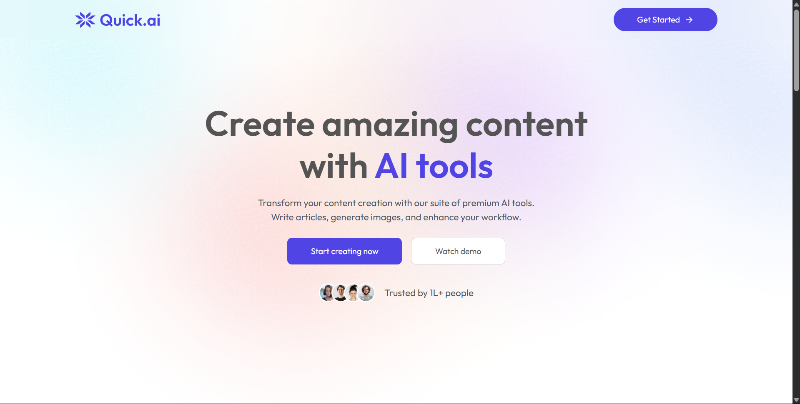
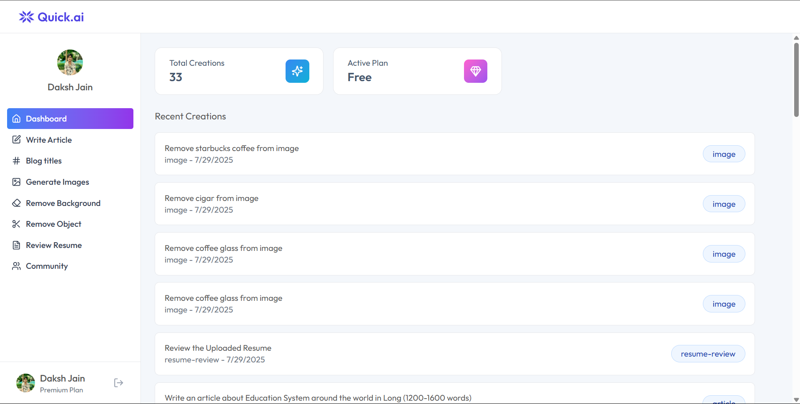
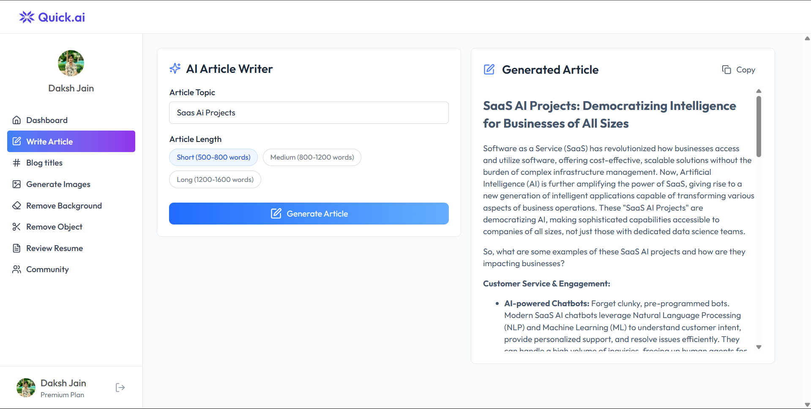
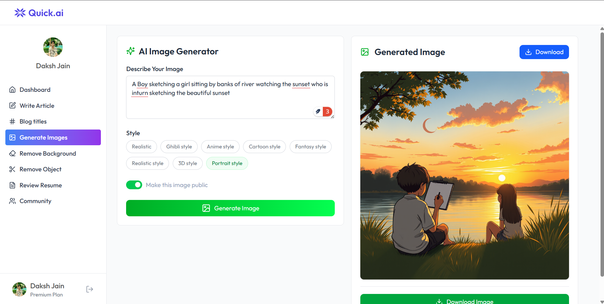

<div align="center">


**Transform your content creation workflow with cutting-edge AI technology**

[](https://reactjs.org/)
[](https://nodejs.org/)
[](https://expressjs.com/)
[](https://tailwindcss.com/)
[](https://vercel.com/)

[Live Demo](https://quick-ai-liard-five.vercel.app/ai) • [Backend API](http://quick-ai-server-rho-six.vercel.app/) • [Report Bug](#) • [Request Feature](#)

</div>


---

## 📋 Table of Contents

- [✨ Features](#-features)
- [🛠️ Tech Stack](#️-tech-stack)
- [🚀 Getting Started](#-getting-started)
- [📱 Screenshots](#-screenshots)
- [🏗️ Architecture](#️-architecture)
- [🔧 API Documentation](#-api-documentation)
- [🎯 Key Features Deep Dive](#-key-features-deep-dive)
- [📊 Performance & Scalability](#-performance--scalability)
- [🔒 Security Features](#-security-features)


---

## ✨ Features

### 🤖 **AI-Powered Content Creation**
- **Article Generation**: Create high-quality, engaging articles on any topic
- **Blog Title Generator**: Generate catchy, SEO-optimized blog titles
- **AI Image Generation**: Create stunning visuals with advanced AI models
- **Background Removal**: Remove backgrounds from images seamlessly
- **Object Removal**: Remove unwanted objects from images with precision
- **Resume Review**: Get AI-powered feedback on your resume

### 👥 **User Management & Social Features**
- **User Authentication**: Secure authentication with Clerk
- **Usage Tracking**: Monitor AI usage with premium/free tier limits
- **Community Features**: Share and discover AI-generated content
- **Like System**: Interactive community engagement
- **Content Publishing**: Public/private content management

### 🎨 **Modern UI/UX**
- **Responsive Design**: Works perfectly on all devices
- **Real-time Updates**: Instant feedback and notifications
- **Intuitive Interface**: User-friendly design with smooth animations

---

## 🛠️ Tech Stack

### **Frontend**
- **React 19.1.0** - Latest React with concurrent features
- **Vite** - Lightning-fast build tool and dev server
- **Tailwind CSS 4.1.11** - Utility-first CSS framework
- **React Router DOM** - Client-side routing
- **Lucide React** - Beautiful icons
- **React Hot Toast** - Elegant notifications
- **React Markdown** - Markdown rendering

### **Backend**
- **Node.js 18+** - JavaScript runtime
- **Express.js 5.1.0** - Web application framework
- **Neon Database** - Serverless PostgreSQL
- **Cloudinary** - Cloud image management
- **Multer** - File upload handling
- **PDF-Parse** - PDF text extraction

### **AI & External Services**
- **Google Gemini AI** - Advanced language model
- **OpenAI API** - Image generation and processing
- **Clerk** - Authentication and user management
- **Cloudinary** - Image transformation and storage

### **Deployment & Infrastructure**
- **Vercel** - Serverless deployment platform
- **GitHub** - Version control and CI/CD
- **Environment Variables** - Secure configuration management

---

## 🚀 Getting Started

### Prerequisites
- Node.js 18+ 
- npm or yarn
- Git

### Installation

1. **Clone the repository**
   ```bash
   git clone https://github.com/yourusername/quickai.git
   cd quickai
   ```

2. **Install dependencies**
   ```bash
   # Install server dependencies
   cd server
   npm install
   
   # Install client dependencies
   cd ../client
   npm install
   ```

3. **Environment Setup**
   
   Create `.env` files in both `server/` and `client/` directories:
   
   **Server Environment Variables:**
   ```env
   DATABASE_URL=your_neon_database_url
   CLOUDINARY_CLOUD_NAME=your_cloudinary_cloud_name
   CLOUDINARY_API_KEY=your_cloudinary_api_key
   CLOUDINARY_API_SECRET=your_cloudinary_api_secret
   OPENAI_API_KEY=your_openai_api_key
   GEMINI_API_KEY=your_gemini_api_key
   CLERK_SECRET_KEY=your_clerk_secret_key
   NODE_ENV=development
   ```

4. **Start development servers**
   ```bash
   # Start backend server (from server directory)
   npm run dev
   
   # Start frontend (from client directory)
   npm run dev
   ```

5. **Access the application**
   - Frontend: http://localhost:5173
   - Backend: http://localhost:3000

---

## 📱 Screenshots

<div align="center">

### 🏠 Homepage


### 🤖 AI Tools Dashboard


### ✍️ Article Generation


### 🎨 Image Generation


</div>

---

## 🏗️ Architecture

```
QuickAI/
├── client/                 # React Frontend
│   ├── src/
│   │   ├── Components/    # Reusable UI components
│   │   ├── Pages/         # Route components
│   │   ├── assets/        # Static assets
│   │   └── App.jsx        # Main app component
│   └── package.json
├── server/                # Node.js Backend
│   ├── controllers/       # Business logic
│   ├── routes/           # API endpoints
│   ├── configs/          # Database & service configs
│   ├── middlewares/   # Custom middleware
    ├── dev-server.js
│   └── api
        ├── server.js                  # Express server
└── README.md
```

### **System Architecture**
- **Frontend**: React SPA with client-side routing
- **Backend**: RESTful API with Express.js
- **Database**: Neon PostgreSQL (serverless)
- **Authentication**: Clerk OAuth integration
- **File Storage**: Cloudinary for image processing
- **Deployment**: Vercel serverless functions

---

## 🔧 API Documentation

### **Authentication Endpoints**
```http
GET /api/auth/status
POST /api/auth/login
POST /api/auth/logout
```

### **AI Content Generation**
```http
POST /api/ai/generate-article
POST /api/ai/generate-blog-title
POST /api/ai/generate-images
```

### **Image Processing**
```http
POST /api/ai/remove-background
POST /api/ai/remove-object
POST /api/ai/resume-review
```

### **User Management**
```http
GET /api/user/get-user-creations
GET /api/user/get-published-creations
POST /api/user/toggle-like-creation
```

### **Response Format**
```json
{
  "success": true,
  "content": "Generated content...",
  "message": "Optional message"
}
```

---

## 🎯 Key Features Deep Dive

### **1. AI Article Generation**
- **Model**: Google Gemini 2.0 Flash
- **Features**: Customizable length, topic-specific generation
- **Quality**: High-quality, engaging content with proper structure
- **Storage**: All generated content saved to database

### **2. Advanced Image Processing**
- **Background Removal**: AI-powered background removal
- **Object Removal**: Precise object removal with AI
- **Image Generation**: Create images from text descriptions
- **Processing**: Real-time image transformation with Cloudinary

### **3. Resume Review System**
- **PDF Processing**: Extract text from uploaded PDFs
- **AI Analysis**: Comprehensive resume feedback
- **Suggestions**: Actionable improvement recommendations
- **Security**: Secure file handling with memory storage

### **4. User Experience**
- **Real-time Feedback**: Instant notifications and loading states
- **Responsive Design**: Mobile-first approach
- **Accessibility**: WCAG compliant design
- **Performance**: Optimized for fast loading

---

## 📊 Performance & Scalability

### **Performance Optimizations**
- **Serverless Architecture**: Automatic scaling with Vercel
- **CDN Integration**: Cloudinary for fast image delivery
- **Database Optimization**: Neon's serverless PostgreSQL
- **Caching**: Intelligent caching strategies
- **Bundle Optimization**: Vite for fast builds

### **Scalability Features**
- **Microservices Ready**: Modular architecture
- **Database Scaling**: Neon's auto-scaling PostgreSQL
- **CDN Distribution**: Global content delivery
- **API Rate Limiting**: Built-in usage tracking
- **Error Handling**: Comprehensive error management

---

## 🔒 Security Features

### **Authentication & Authorization**
- **OAuth Integration**: Secure authentication with Clerk
- **JWT Tokens**: Stateless authentication
- **Role-based Access**: Premium/free user management
- **Session Management**: Secure session handling

### **Data Protection**
- **Environment Variables**: Secure configuration management
- **Input Validation**: Comprehensive input sanitization
- **File Upload Security**: Secure file handling
- **SQL Injection Prevention**: Parameterized queries
- **CORS Configuration**: Proper cross-origin handling

### **Privacy & Compliance**
- **GDPR Compliance**: User data protection
- **Data Encryption**: Encrypted data transmission
- **Privacy Controls**: User data management
- **Audit Logging**: Comprehensive activity tracking

---

## 🚀 Deployment

### **Frontend Deployment (Vercel)**
```bash
# Build the project
npm run build

# Deploy to Vercel
vercel --prod
```

### **Backend Deployment (Vercel)**
```bash
# Set environment variables in Vercel dashboard
# Deploy server directory
vercel server/ --prod
```

### **Environment Variables Setup**
1. **Vercel Dashboard**: Add all required environment variables
2. **Database**: Configure Neon database connection
3. **External Services**: Set up Cloudinary, Clerk, and AI APIs
4. **Domain**: Configure custom domain (optional)

---


## 🙏 Acknowledgments

- **Google Gemini AI** for advanced language processing
- **OpenAI** for image generation capabilities
- **Clerk** for authentication services
- **Cloudinary** for image processing
- **Vercel** for deployment platform
- **Neon** for serverless database

---

## 📞 Contact

- **Project Link**: [https://github.com/Dakshj04/quickai](https://github.com/yourusername/quickai)
- **Live Demo**: [https://quickai.vercel.app](https://quick-ai-liard-five.vercel.app/ai)
- **Email**: 0408jaindaksh@gmail.com
- **LinkedIn**: https://www.linkedin.com/in/daksh-jain-7a4327259/

---

<div align="center">

**Made with ❤️ by Daksh Jain**

⭐ **Star this repository if you found it helpful!**

</div> 
